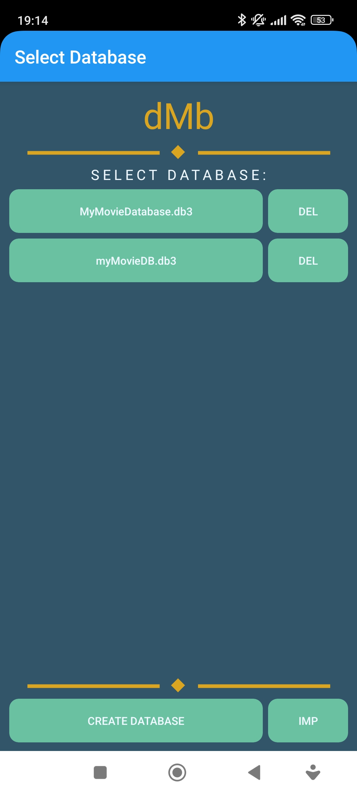
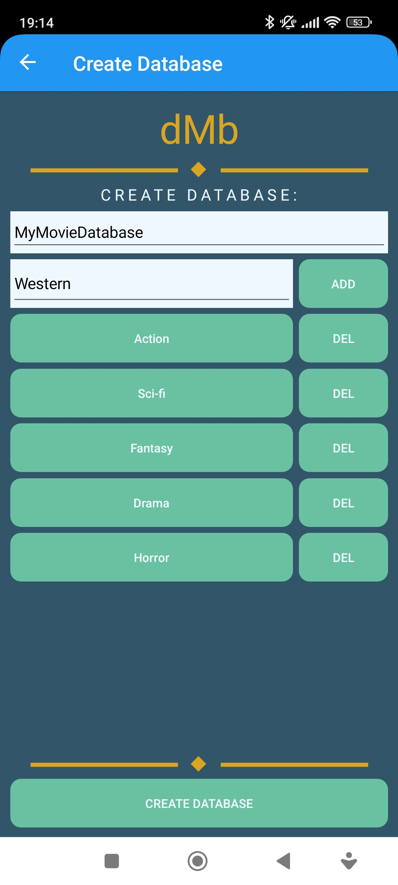
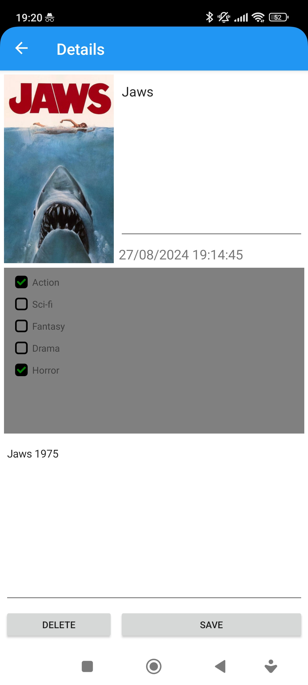
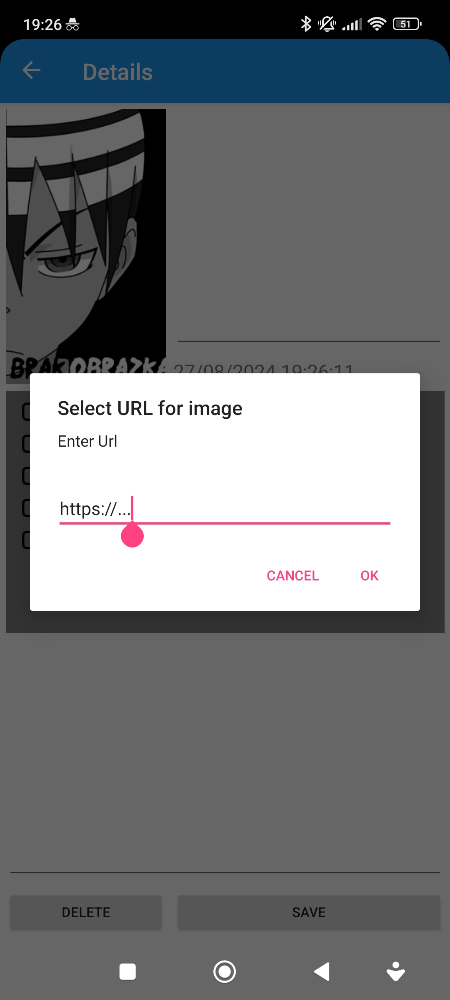
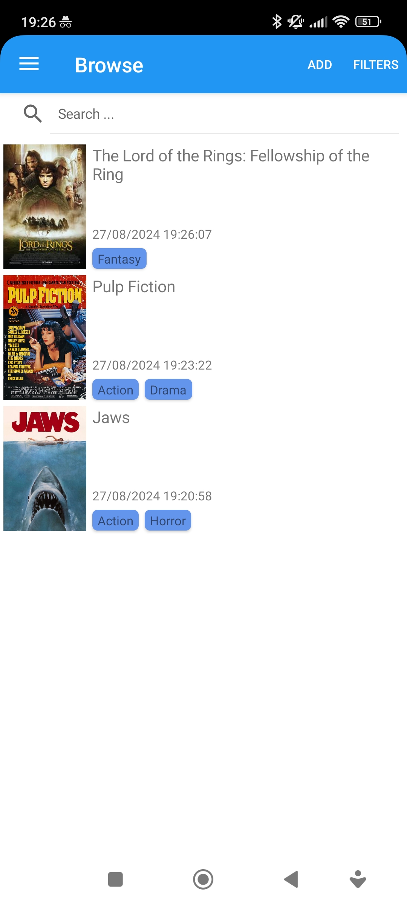
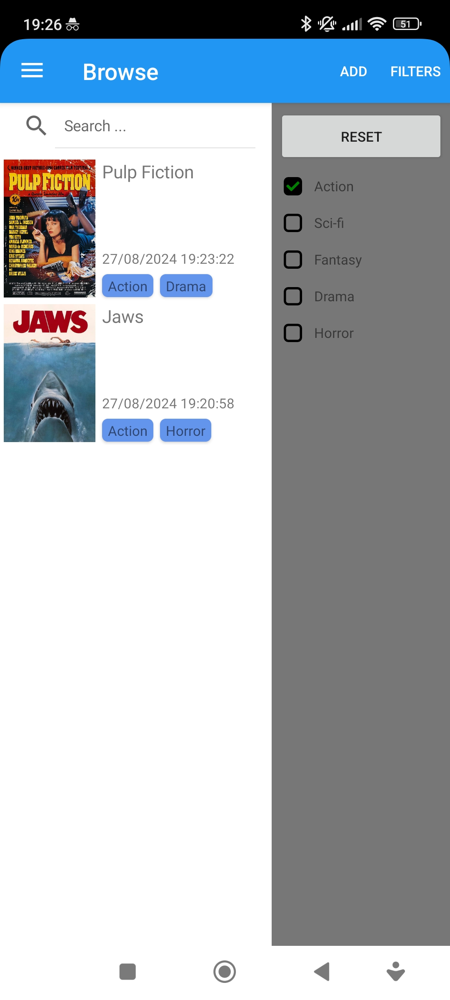
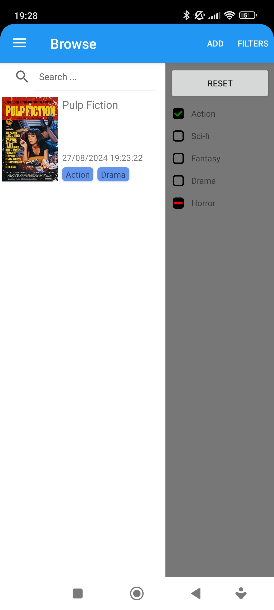

  

<h3 align="center">dMb</h3>

Personal database

  
Contents

  <ol>
    <li><a href="#About-project">About project</a></li>
    <ul>
      <li><a href="#Features">Features</a></li>
      <li><a href="#Used-technology">Used technology</a></li>
      <li><a href="#Requirements">Requirements</a></li>
    </ul>
    <li><a href="#Installation">Installation</a></li>
    <li><a href="#License">License</a></li>
  </ol>

## About project
**dMb** is cross platform (Android, Windows UWP) application for browsing offline database with searching, genres filters and custom controls. Developed using MVVMS architecture, design patterns and layout written in XML.

  
  
  
  

  
  
  

### Features:
- [x] Create multiple databases
- [x] Create custom tags
- [x] Import / Export databases
- [x] Add and edit items (title, image, description, tags)
- [x] Add image from URL to item
- [x] Searching by title
- [x] Filters for easy browsing items
- [x] Sort list view by best tags match
- [ ] Select sorting strategy

### Used technology:
<table>
  <tr>
    <td></td>
    <td></td>
    <td></td>
    <td></td>
  </tr>
  <tr>
    <th>C#</th>
    <th>.NET</th>
    <th>Xamarin</th>
    <th>SQLite</th>
  </tr>
</table>

### Requirements:
<ul>
  <li>recommended: Android 11 - Red Velvet Cake (SDK 30)</li>
  <li>min: Android 5.0 - Oreo (SDK 21)</li>
</ul>

<!--
## Installation
TBA

## License
TBA -->
